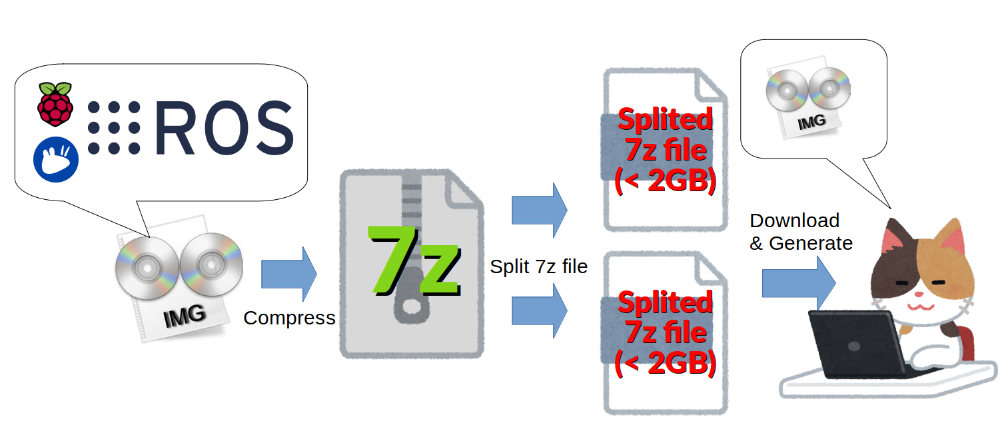
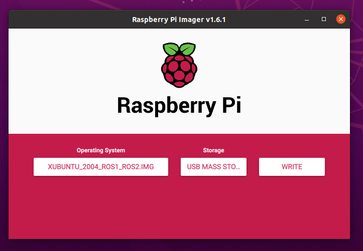
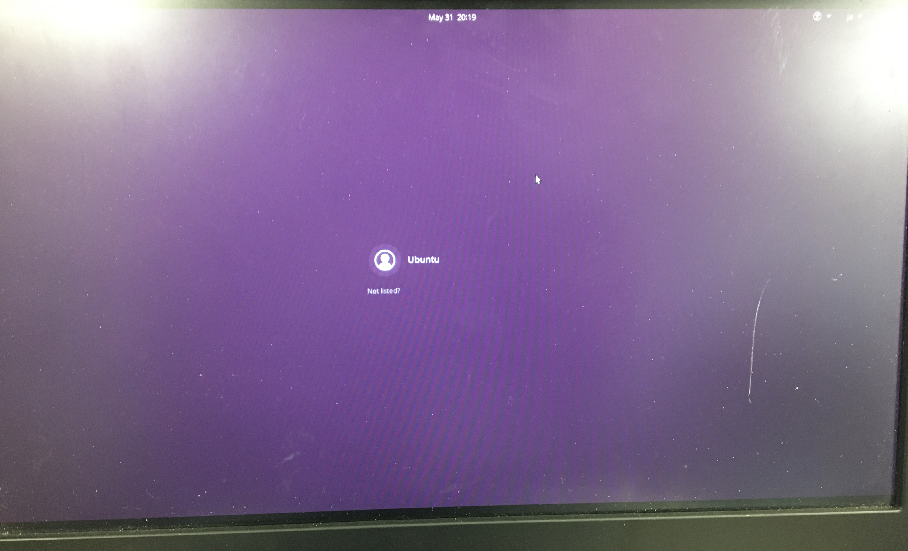
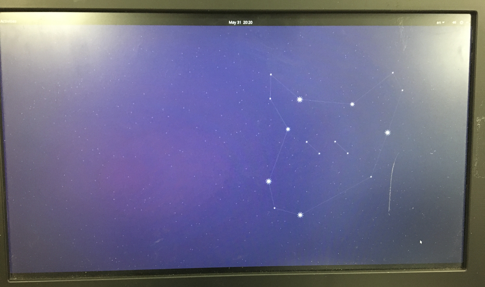
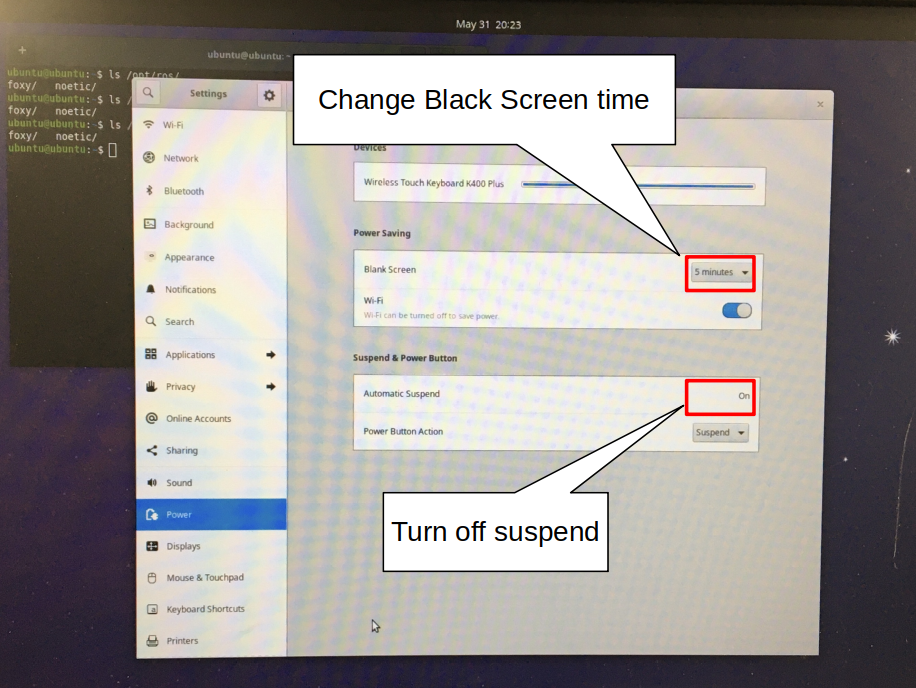

# rpi_xubuntu_ros
Raspberry Pi + xubuntu 20.04 + ROS (Noetic & Foxy)

---

　Installing a ROS learning environment on a Raspberry Pi is very difficult: install Ubuntu Server, install Ubuntu Desktop, install ROS...

But what if someone has published a pre-made img file? It could be easy.
This repository provides a split img file of a pre-built Xubuntu + ROS environment.


## System Requirements

- Raspberry Pi 4 model B 2GB RAM
- 16GB or larger SD Card
- PC with file integration (cat command), 7z decompression, and SD card writing capability.


## What's that mysterious file?

　As a specification, you cannot upload files larger than 2GB to GitHub.
Therefore, it was necessary to compress the img file and split the file.

　That img file can be obtained by combining the downloaded files and uncompressing combined file using the 7z tool.



## Write img to SD

　Here we will show you how to write to the SD card assuming you are using Ubuntu.

> Note : Be sure to pay enough attention to the communication capacity.

### 1. Install tools

```bash
$ sudo apt install rpi-imager
$ sudo apt install p7zip-full
```

### 2. Download splited images

```bash
$ wget https://github.com/Ar-Ray-code/rpi_xubuntu_ros/releases/download/20.04_v1.0/splited_xubuntu_2004_ros1_ros2_7z_00
$ wget https://github.com/Ar-Ray-code/rpi_xubuntu_ros/releases/download/20.04_v1.0/splited_xubuntu_2004_ros1_ros2_7z_01
```

### 3. Generate img file & Write to SD

```bash
$ cat splited_xubuntu_2004_ros1_ros2_7z_0* >> image.7z
$ 7z x image.7z
$ rpi-imager &
```

Specify the SD card and the generated img file.
After extracting the 7z file, the file name will be "xubuntu_2004_ROS1_ROS2.img".



Press "write" button to write to SD Card.

## Login

After writing to the SD card, unmount it and insert into the Raspberry Pi.

The GUI for the login screen will be displayed.



Enter the password for login.

__Password is "ubuntu20"__



Installation is complete.:strawberry::penguin::turtle::star2:

## Recommended settings

### Black Screen & Suspend

- About Black Screen : Change "Black Screen" 5 minutes to Never.
- About Suspend : Change "Automatic Suspend" On to OFF.

> Note : If the Raspberry Pi goes into a suspend state, it may not be able to come back from the suspend state.　This bug will be fixed in the next release.




## Reference 

https://www.raspberrypi.org/documentation/installation/installing-images/


## About writer

- Ar-Ray : Japanese student.
- Blog (Japanese) : https://ar-ray.hatenablog.com/
- Twitter : https://twitter.com/Ray255Ar
